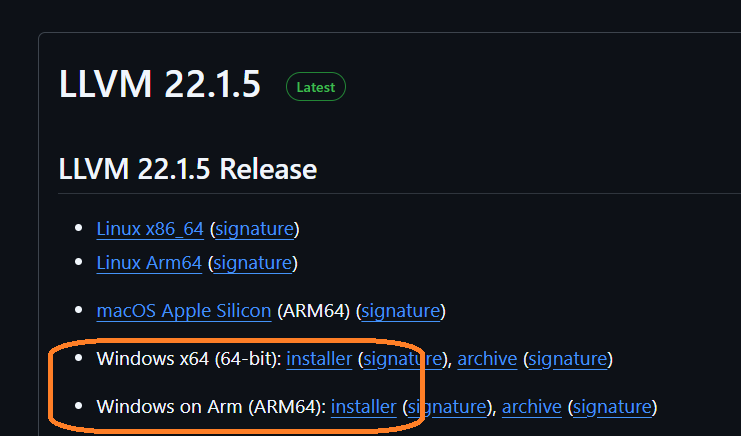

# Setting up your machine

## Setting up the C++ compiler
We will require a C++ 23 standards compiler to compile the code in these projects. We'll be using the CLang compiler toolchain.

### On Linux
Below are the steps to install on major Linux distros - I have tested on Manjaro Linux only. If the instruction for your Linux distro (e.g. Ubuntu) as mentioned below does not work, do let me know.

**1. Debian / Ubuntu / Mint / Kali (The apt family)**
```bash 
$> sudo apt install libc++-22-dev libc++abi-22-dev
```

**2. Fedora / RedHat / CentOS / AlmaLinux (The dnf family)**
```bash 
$> sudo dnf install clang libcxx-devel
```

**3. Arch / Manjaro / EndeavourOS (The pacman family)**
```bash
$> sudo pacman -Syu clang
```

#### Testing your install
* Open a Linux shell
* Type in the following command (`$>` is command prompt - don't type that!)
```bash
$> clang++ --version
```
You should see something like this
```bash
clang version 22.1.0
Target: x86_64-pc-linux-gnu
Thread model: posix
InstalledDir: /usr/bin
```
* Type in the following code into your favourite code editor (mine is `vim`) & save it to some folder - say `~/code/temp.cpp` \
```c++
#include <iostream>
#include <string>

// This function uses std::expected (C++23)
// It returns a string on success, or an int error code on failure
std::expected<std::string, int> get_status(bool success) {
    if (success) return "System Online";
    return 404;
}

int main() {
    auto result = get_status(true);
    
    if (result) {
        std::cout << "C++23 Success: " << *result << std::endl;
    }
    
    return 0;
}
```

* On the command line of your shell and in the folder where you saved above code, type the following
```bash
$ ~/code> clang++ --std=c++23 temp.cpp -o temp && ./temp
```
if you do not get any compile errors and program displays output, you are all set!

### On Windows 
Navigate to the [LLVM Project Repo on Github](https://github.com/llvm/llvm-project/releases). 

Click any one of the _installer_ links for Windows (as shown in the screen below), depending on the CPU you have. 

<div align="center"> 
 
</div>

It will download an executable installer. 

Run the installer to install `clang` C and C++ compilers -- follow instructions & install. 

After install is completed, **ensure that you add the `bin` subfolder of the install directory to your Windows search path**. For example, if you installed to the `C:\LLVM` folder, then add `C:\LLVM\bin` to your search path.

#### Testing your install
* Open a Powershell window
* Type in the following command 

```powershell
PS C:\Users\MyName> Get-Command clang++ | Select-Object -Property Source
```
This should show you output like this, confirming that `clang++` will run from your installed directory
```powershell
Source
------
C:\LLVM\bin\clang++.exe
```
* Next, type in the following code into your favourite editor and save it as `test.cpp` to some folder (say `c:\temp`)
```c++
#include <iostream>
#include <string>

// This function uses std::expected (C++23)
// It returns a string on success, or an int error code on failure
std::expected<std::string, int> get_status(bool success) {
    if (success) return "System Online";
    return 404;
}

int main() {
    auto result = get_status(true);
    
    if (result) {
        std::cout << "C++23 Success: " << *result << std::endl;
    }
    
    return 0;
}
```
* Run the following compile command from `c:\temp` folder
```powershell
c:\temp> clang++ -std=c++23 test.cpp -o test.exe
```
If you **don't get any compiler errors**, you are all set!

## Setup spdlog

We have enabled logging using `spdlog` library - a standard cross-platform logging framework for C++ programs.


### On Linux
**1. Debian / Ubuntu / Mint / Kali (The apt family)**
```bash 
$> sudo apt update && sudo apt install libspdlog-dev
```
**2. Fedora / RedHat / CentOS / AlmaLinux (The dnf family)**
```bash 
$> sudo dnf install spdlog-devel
```

**3. Arch / Manjaro / EndeavourOS (The pacman family)**
```bash
$> sudo pacman -S spdlog
```

### On Windows
